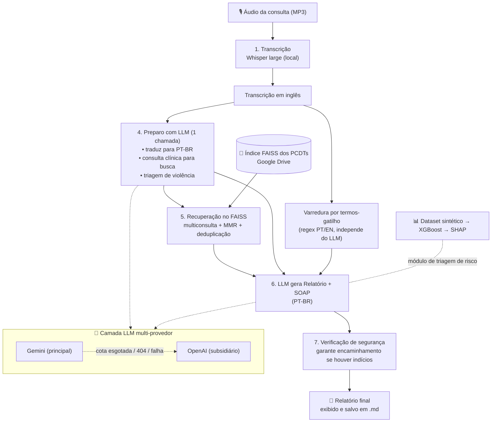

# 🛡️🩺 Guardiã AI — Inteligência Artificial para Saúde e Segurança da Mulher

[](https://www.fiap.com.br/)
[](https://github.com/marceloklotz/fiap-quinta-fase/)

> Protótipo de apoio ao atendimento clínico que transforma o **áudio de uma consulta médica** em um **Relatório Médico + Prontuário SOAP** fundamentado nos **PCDTs do Ministério da Saúde**, com **rastreio de violência doméstica** e orientação de encaminhamento imediato.

[](https://colab.research.google.com/github/marceloklotz/fiap-quinta-fase/blob/main/GUARDIA_IA_MULTI_LLM.ipynb)


> ⚠️ **Aviso:** protótipo acadêmico. **Não é um dispositivo médico** e **não substitui o julgamento clínico**. Todo relatório gerado deve ser revisado por um profissional de saúde.

Desenvolvido no âmbito do **Tech Challenge da Quinta Fase da Pós Tech (8IADT)** da **FIAP – Faculdade de Informática e Administração Paulista**, conforme requisitos contidos no PDF disponível no presente repositório. 

## 👥 Integrantes do grupo
Os membros do grupo são compostos pelos seguintes servidores da **Secretaria de Segurança Pública do Distrito Federal (SSP/DF)**:

- Alexandre Natã Vicente (**rm370024**) (ale.n.vicente@gmail.com)
- Antônio Cláudio Almeida (**rm370052**) (antonioalmeida@gmail.com)
- Cyd Ferreira Rodrigues (**rm370004**) (cydnelson@gmail.com)
- David Catherink (**rm369997**) (d.catherinck@gmail.com)
- Marcelo Macedo Klotz (**rm370010**) (marceloklotz@gmail.com) 

## 📑 Sumário

1. [Visão geral](#-visão-geral)
2. [Principais funcionalidades](#-principais-funcionalidades)
3. [Arquitetura e fluxo](#-arquitetura-e-fluxo)
4. [Estrutura do notebook](#-estrutura-do-notebook)
5. [Requisitos](#-requisitos)
6. [Como executar](#-como-executar)
7. [Configuração de provedores de LLM (Gemini + OpenAI)](#-configuração-de-provedores-de-llm-gemini--openai)
8. [Detalhamento técnico das etapas](#-detalhamento-técnico-das-etapas)
9. [Módulo de violência doméstica](#-módulo-de-violência-doméstica)
10. [Estrutura do relatório gerado](#-estrutura-do-relatório-gerado)
11. [Resultados dos modelos de triagem](#-resultados-dos-modelos-de-triagem)
12. [Solução de problemas](#-solução-de-problemas)
13. [Limitações e próximos passos](#-limitações-e-próximos-passos)
14. [Ética, privacidade e LGPD](#-ética-privacidade-e-lgpd)
15. [Repositório e materiais de apoio](#-repositório-e-materiais-de-apoio)

---

## 🔎 Visão geral

O **Guardiã AI** recebe o áudio (MP3) de uma consulta médica simulada e executa uma pipeline de ponta a ponta:

1. **Transcreve** a fala com o **Whisper** (execução local, sem enviar o áudio a uma API externa).
2. **Estima o risco clínico** com um classificador **XGBoost** treinado em dados **sintéticos**, explicado com **SHAP** e comparado a uma **Regressão Logística**.
3. Consulta a **base de conhecimento (RAG)**: os **PCDTs** oficiais vetorizados em um índice **FAISS** com embeddings multilíngues (`multilingual-e5-base`).
4. Usa um **LLM (Gemini ou OpenAI)** para traduzir o relato, gerar a consulta clínica de busca e fazer a **triagem de violência doméstica**.
5. Gera o **Relatório Médico + SOAP** em português, citando o PCDT e a portaria recuperados.
6. Aplica uma **rede de segurança** que garante a orientação de encaminhamento quando há indícios de violência.

### 🎯 Objetivos

- Reduzir o tempo de documentação clínica e padronizar o registro do atendimento.
- Apoiar a conduta médica com base em protocolos oficiais (PCDT), **citando a fonte recuperada**.
- Ampliar a identificação de casos de violência doméstica durante a consulta, sem depender apenas da percepção individual do profissional.

---

## ✨ Principais funcionalidades

| Funcionalidade | Descrição |
|---|---|
| 🎙️ **Transcrição local** | Whisper (`large`) transcreve o áudio em inglês de forma fiel, com prompt de contexto médico. |
| 🧠 **Triagem de risco explicável** | XGBoost + SHAP, com Regressão Logística como *baseline*, avaliados por **Recall** e **F1-Score**. |
| 📚 **RAG sobre PCDTs** | Índice FAISS (28.514 vetores, 768 dimensões) com busca multiconsulta, **MMR** e deduplicação. |
| 🔀 **LLM multi-provedor** | **Gemini como principal e OpenAI como subsidiária**, com alternância automática ao esgotar cota. |
| 🛡️ **Violência doméstica** | Pré-análise por LLM + varredura por termos-gatilho (PT/EN) + checagem pós-geração. |
| 🧾 **Prontuário SOAP** | Relatório estruturado em português, com regras antialucinação para o PCDT e a portaria. |
| ♻️ **Resiliência e economia** | *Backoff* exponencial com *jitter*, cache em memória, bloqueio temporário de modelos que falham. |

---

## 🧭 Arquitetura e fluxo



**Ideias de arquitetura que valem destacar**

- **Transcrição em inglês, local:** o áudio de exemplo é em inglês e o Whisper roda no próprio ambiente, preservando a privacidade do áudio e evitando gastar cota de LLM com tradução de fala.
- **Uma única chamada de preparo:** tradução, consulta de busca e triagem de violência são obtidas juntas (JSON), reduzindo requisições.
- **Query clínica curta no RAG:** o modelo E5 trunca em ~512 tokens; por isso a busca usa uma consulta clínica sintética e consultas secundárias (hipóteses), e não a transcrição inteira.
- **Camadas de segurança independentes do LLM:** os termos-gatilho de violência continuam funcionando mesmo que a cota de todos os provedores esgote.

---

## 🗂️ Estrutura do notebook

O arquivo principal é **`GUARDIA_IA_MULTI_LLM.ipynb`**. Ordem das seções:

| # | Seção | O que faz |
|---|---|---|
| 1 | **Instalação de dependências** | `pip install` em blocos lógicos (`-q`, `--no-cache-dir`, `-U`). |
| 2 | **Configuração inicial** | Importações e **campos de chave** (Google e OpenAI). |
| 3 | **Montagem do Google Drive** | Acesso ao índice FAISS e aos PCDTs. |
| 4 | **Dataset sintético** | 5.000 registros de triagem (Faker `pt_BR`). |
| 5 | **XGBoost + SHAP** | Classificador de urgência crítica e explicabilidade. |
| 6 | **Regressão Logística** | *Baseline* para comparação. |
| 7 | **Matrizes de confusão e análises** | Comparativo, discussão de métricas e importância de variáveis. |
| 8 | **Módulos auxiliares** | Análise vocal (`librosa`), transcrição (`whisper`) e SOAP em inglês. |
| 9 | **Pipeline – Etapa 2** | Upload do MP3 + transcrição com Whisper `large`. |
| 10 | **Pipeline – Etapa 3.1** | Carregamento do índice FAISS gerado localmente. |
| 11 | **Pipeline – Etapa 4** | Preparo com LLM, RAG, relatório + SOAP, violência doméstica e salvamento. |

---

## 🧰 Requisitos

| Requisito | Detalhes |
|---|---|
| **Ambiente** | Google Colab. **GPU recomendada** (Whisper `large` e embeddings). O notebook foi executado com GPU L4. |
| **Chave do Google (Gemini)** | Gerada no [Google AI Studio](https://aistudio.google.com/apikey). Nome: `GOOGLE_API_KEY`. |
| **Chave da OpenAI (alternativa)** | Gerada em [platform.openai.com/api-keys](https://platform.openai.com/api-keys). Nome: `OPENAI_API_KEY`. |
| **Regra das chaves** | É necessária **ao menos uma** das duas. Com as duas, a OpenAI atua como provedor subsidiário. |
| **Google Drive** | Conta Google com permissão para `drive.mount` e acesso à pasta do índice. |
| **Pasta do índice FAISS** | [Pasta com o índice FAISS dos PCDTs](https://drive.google.com/drive/folders/1FE3dc8feAsnm7lyRGhOsw2a1mYD7ZFs2?usp=sharing). Adicione ao seu Drive (atalho ou cópia) em `MyDrive/PCDT_FAISS_E5`. |
| **Áudio de atendimento** | Um MP3 de [`MP3_Selecionados`](https://github.com/marceloklotz/fiap-quinta-fase/tree/main/MP3_Selecionados). |

**Principais bibliotecas:** `openai-whisper`, `librosa`, `deep-translator`, `transformers`, `sentence-transformers`, `langchain-core`, `langchain-community`, `faiss-cpu`, `faker`, `tiktoken`, `langchain-google-genai`, `google-generativeai`, `google-genai`, `openai`, `xgboost`, `shap`, `scikit-learn`, `pandas`, `numpy`, `matplotlib`, `seaborn`.

---

## ▶️ Como executar

1. **Abra o notebook no Colab** (botão no topo) e selecione um ambiente com **GPU**.
2. **(Recomendado) Cadastre as chaves nos Secrets 🔑** do Colab, com os nomes `GOOGLE_API_KEY` e/ou `OPENAI_API_KEY`, e **ative o acesso ao notebook**. Alternativa: digite-as nos campos exibidos na célula de configuração (**ENTER** pula um provedor).
3. **Monte o Google Drive** e confirme que a pasta `PCDT_FAISS_E5` está acessível em `MyDrive`.
4. **Execute as células em ordem** (*Ambiente de execução → Executar tudo*). Quando solicitado, **faça upload do MP3**.
5. Ao final, o relatório é exibido na tela e salvo em **`/content/relatorio_guardia_ai.md`**.

### 🔁 Processando um novo áudio na mesma sessão

Se a sessão do Colab continua ativa, **não é necessário reexecutar** a etapa 3.1 (FAISS): `embeddings`, `vectorstore` e `retriever` permanecem em memória e não dependem do áudio. Basta:

1. Reexecutar a **Etapa 2** (upload + transcrição), que redefine `transcricao_paciente`;
2. Reexecutar a **Etapa 4** (relatório).

O cache da Etapa 4 considera a transcrição na chave; um áudio novo gera um relatório novo sem precisar de `FORCAR_NOVA_GERACAO`. Reexecute a 3.1 apenas se a sessão tiver sido reiniciada/desconectada ou se as variáveis tiverem sido perdidas.

> 💡 Na versão atual, a célula da Etapa 2 também regenera o dataset sintético e retreina os modelos. Isso é mais lento; se for trocar de áudio com frequência, considere isolar upload e transcrição em uma célula própria.

---

## 🔀 Configuração de provedores de LLM (Gemini + OpenAI)

Toda chamada de LLM passa por **`chamar_llm()`**, que percorre uma fila `(provedor, modelo)`. Se um modelo falha por **cota esgotada, modelo inexistente (HTTP 404), chave recusada ou instabilidade persistente**, segue para o próximo, inclusive **trocando de provedor**. (`chamar_gemini` continua disponível como apelido.)

### Parâmetros (célula da Etapa 4, seção 4.1)

| Parâmetro | Padrão | Função |
|---|---|---|
| `MODO_PROVEDOR` | `"gemini_primeiro"` | `"gemini_primeiro"`, `"openai_primeiro"`, `"somente_gemini"` ou `"somente_openai"`. |
| `MODELOS_GEMINI` | `["gemini-3.8-flash", "gemini-2.5-flash"]` | Modelos Gemini, em ordem de prioridade. |
| `MODELOS_OPENAI` | `["gpt-6-sol", "gpt-6-luna", "gpt-5.4-mini"]` | Modelos OpenAI, em ordem de prioridade. |
| `OPENAI_REASONING_EFFORT` | `None` | `"minimal"`, `"low"`, `"medium"` ou `"high"` para modelos de raciocínio. |
| `MAX_TENTATIVAS_POR_MODELO` | `4` | Tentativas antes de trocar de modelo. |
| `ESPERA_MAXIMA_S` | `75` | Se a API pedir espera maior, troca de modelo em vez de esperar. |
| `INTERVALO_MIN_ENTRE_CHAMADAS_S` | `1.5` | Intervalo mínimo entre chamadas. |
| `BLOQUEIO_LIMITE_S` / `BLOQUEIO_COTA_S` / `BLOQUEIO_INVALIDO_S` | `300` / `6 h` / `24 h` | Por quanto tempo um modelo que falhou fica bloqueado na sessão. |
| `MAX_TOKENS_PREPARO` / `MAX_TOKENS_RELATORIO` | `8192` / `12000` | Tetos de tokens de saída. |
| `USAR_CACHE` / `FORCAR_NOVA_GERACAO` | `True` / `False` | Cache em memória e regeneração forçada. |

> ℹ️ **Nomes de modelos mudam com frequência.** Confira os disponíveis na sua conta ([modelos Gemini](https://ai.google.dev/gemini-api/docs/models), [modelos OpenAI](https://developers.openai.com/api/docs/models)) e ajuste as listas. Um modelo inexistente é apenas pulado.

### Comportamento

- **Provedor sem chave é ignorado**, sem erro.
- **Classificação de erros:** cota diária/saldo, limite de requisições, sobrecarga, modelo inválido, chave inválida, resposta truncada e erro inesperado, cada um com a ação apropriada.
- **Espera sugerida pela API** (`retry in 34s`, `try again in 1.2s`, `6m0s`) é respeitada.
- **Compatibilidade com a OpenAI:** usa `max_completion_tokens`, `response_format=json_object` na etapa de preparo e **remove sozinha parâmetros recusados** (ex.: `temperature` em modelos de raciocínio).
- **Bloqueio temporário:** evita repetir tentativas inúteis entre o preparo e o relatório; trocar a chave desbloqueia automaticamente. Use `resetar_bloqueios()` para limpar manualmente.
- **Diagnóstico:** `mostrar_configuracao_llm()` exibe a ordem efetiva de tentativa; em falha total, o erro lista o motivo de cada modelo.

---

## 🔬 Detalhamento técnico das etapas

### 1) Dataset sintético de triagem

- **5.000 registros** com nome, gênero, data de nascimento, RG, CPF (Faker `pt_BR`) e histórico de comorbidades.
- **Sinais vitais** simulados por distribuições normais limitadas (`np.clip`): pressão sistólica/diastólica, frequência cardíaca e respiratória, temperatura e SpO₂; além de `taxa_hesitacao_porcento`.
- **Alvo `urgencia_critica`:** `SpO₂ < 93` **ou** (`hesitação > 30` **e** `FC > 115`).
- **`suspeita_violencia_domestica` (S/N):** probabilidade dependente do gênero e, em menor grau, da hesitação vocal. É um **indicador de rastreio (suspeita)**, não um diagnóstico.
- Exporta `/content/dataset_guardia_ai_triagem.csv`.

> As probabilidades usadas são **premissas de simulação**, sem validação epidemiológica.

### 2) Modelos de triagem e explicabilidade

- **Features:** `idade`, `pressao_sistolica`, `pressao_diastolica`, `frequencia_cardiaca`, `frequencia_respiratoria`, `temperatura_celsius`, `spo2_porcento`, `taxa_hesitacao_porcento`, `possui_comorbidade`.
- **XGBoost** (`n_estimators=100`, `learning_rate=0.1`, `max_depth=5`, `scale_pos_weight` para o desbalanceamento) com divisão estratificada 80/20.
- **SHAP** (`TreeExplainer`) e a função `analisar_risco_shap`, que gera uma justificativa textual com as variáveis que mais elevaram o risco.
- **Regressão Logística** (`class_weight="balanced"`) como *baseline*.
- **Métricas priorizadas:** **Recall** (minimizar falsos negativos, o erro mais grave em triagem) e **F1-Score** (equilíbrio com a precisão).

### 3) Módulos de áudio

- **Transcrição:** Whisper `large`, `language="en"`, `beam_size=5`, `condition_on_previous_text=False` e `initial_prompt` de contexto clínico.
- **Análise vocal (`analisar_tom_e_hesitacao`):** com `librosa`, calcula a **taxa de hesitação** (proporção de silêncio, limiar de 30 dB) e a **variação de pitch (F0)**. Classifica em 🟢 *Estável*, 🟡 *Alta hesitação* (> 25 % de silêncio) ou 🔴 *Tom instável/emocional* (desvio de pitch > 50).

### 4) RAG sobre os PCDTs

- **Índice pré-construído** localmente (script incremental com hashes SHA-256 e *checkpoints*) e sincronizado no Google Drive; o Colab **não reprocessa** os PCDTs.
- **Embeddings:** `intfloat/multilingual-e5-base` via `sentence-transformers`, com os prefixos exigidos pelo E5 (`passage:` para documentos, `query:` para consultas).
- **Validação de integridade:** o notebook confere `embedding_config.json` (modelo e dimensão) antes de abrir o FAISS, evitando incompatibilidade silenciosa.
- **Busca avançada:** consulta principal + até 4 consultas secundárias (hipóteses) + consulta específica sobre violência quando há indícios; **MMR** para diversidade; intercalação por posição e **deduplicação**; `TOP_K_FINAL = 6` e teto de **14.000 caracteres** de contexto.

### 5) Geração do relatório

- **Prompt defensivo:** proíbe "forçar" um PCDT irrelevante (deve declarar *"Nenhum PCDT do contexto recuperado é diretamente aplicável"*), exige que a **portaria** seja copiada exatamente dos metadados (ou *"Não informada nos metadados"*) e separa condutas do PCDT de "boa prática clínica geral".
- **Injeção de prompt:** a transcrição é delimitada (`<<<RELATO>>> … <<<FIM>>>`) e tratada apenas como **dado**.
- **Verificação de consistência:** avisa se nenhuma das portarias recuperadas aparece no relatório.

---

## 🚨 Módulo de violência doméstica

Quatro camadas complementares:

| Camada | Descrição |
|---|---|
| **1. Pré-análise por LLM** | Na chamada de preparo, retorna `medico_perguntou` (sim/não), `nivel` (`nenhum` / `suspeita` / `relato`) e `evidencias` literais. |
| **2. Termos-gatilho (regex)** | Varredura em PT e EN (ameaça, agressão, medo de parceiro/familiar, violência sexual etc.), **independente do LLM e da cota**. |
| **3. RAG dirigido** | Se há indícios, inclui uma consulta sobre atenção integral a pessoas em situação de violência. |
| **4. Rede de segurança pós-geração** | Se há alerta e o relatório omitiu a seção ou o encaminhamento, o **bloco padrão é anexado automaticamente**. |

**Seção 4 do relatório** usa caixas de seleção (☒/☐):

- Houve questionamento médico sobre violência? (**sim** / **não**)
- Existência de violência: **relatada/confirmada**, **suspeita/indícios**, **não há indícios** (afastada após questionamento) ou **não avaliado**.

> Regra importante: **ausência de pergunta não equivale a ausência de violência.** Se o tema não foi abordado e não há indícios, a marcação correta é *Não avaliado*, com recomendação ao médico de abordar o assunto em ambiente reservado.

**Orientação ao médico, em caso de relato ou suspeita:** informar sobre o atendimento especializado e **oferecer encaminhamento imediato** (CRAM, Casa da Mulher Brasileira, DEAM, serviço de referência para violência sexual, CREAS, Conselho Tutelar, Disque 100, Ligue 180, conforme o perfil); avaliar risco imediato (190/192); garantir privacidade; registrar objetivamente; observar a notificação compulsória (SINAN) e a comunicação à autoridade policial em até 24 h nos casos de violência contra a mulher (Leis nº 10.778/2003 e nº 13.931/2019).

---

## 📄 Estrutura do relatório gerado

```text
1. DADOS DO PACIENTE
2. ANÁLISE DO RELATO
3. DIRETRIZES E PROTOCOLO PCDT   → nome do protocolo, portaria (dos metadados), condutas
4. AVALIAÇÃO DE VIOLÊNCIA DOMÉSTICA   → checkboxes ☒/☐, evidências, orientação ao médico
5. PRONTUÁRIO MÉDICO – SOAP
      S (Subjetivo) · O (Objetivo) · A (Avaliação) · P (Plano)
```

Saída: exibida no notebook e salva em `/content/relatorio_guardia_ai.md`. Quando há indícios de violência, um alerta 🚨 é impresso no topo.

---

## 📊 Resultados dos modelos de triagem

Conjunto de teste: 1.000 registros (20 %), com 231 casos críticos.

| Modelo | Recall | F1-Score | VP | VN | FP | FN |
|---|---|---|---|---|---|---|
| **XGBoost** | 1,0000 | 1,0000 | 231 | 769 | 0 | 0 |
| **Regressão Logística** | 0,8398 | 0,7016 | 192 | 640 | 129 | 39 |

> ⚠️ **Interpretação:** o alvo foi gerado por **regras determinísticas** sobre as próprias variáveis de entrada; por isso o desempenho perfeito do XGBoost **não constitui validação clínica** nem estimativa de desempenho em dados reais. A comparação serve para ilustrar o efeito de falsos negativos e falsos positivos em triagem.

Distribuição do dataset sintético: 2.602 registros femininos e 2.398 masculinos; suspeita de violência em 17,3 % (feminino), 5,3 % (masculino) e 11,5 % no total, valores derivados das premissas de simulação.

---

## 🩹 Solução de problemas

| Sintoma | Causa provável | O que fazer |
|---|---|---|
| `404 NOT_FOUND ... model is no longer available` | Modelo Gemini descontinuado para sua chave | Ajuste `MODELOS_GEMINI`; o código já pula para o próximo modelo/provedor. |
| `429 RESOURCE_EXHAUSTED` / `insufficient_quota` | Cota do provedor esgotada ou sem saldo | Aguarde, use outra chave ou informe a chave do outro provedor; a alternância é automática. |
| `Todos os modelos configurados ... falharam` | Todos os modelos falharam | Leia a lista de motivos no erro; verifique chaves, saldo e nomes dos modelos. |
| `Nenhum provedor de LLM utilizável` | Nenhuma chave válida para o `MODO_PROVEDOR` | Informe `GOOGLE_API_KEY` e/ou `OPENAI_API_KEY` ou ajuste o modo. |
| Chave recusada (401/403) | Chave inválida ou sem permissão | Gere outra chave; o provedor é ignorado até a troca. |
| Resposta vazia ou truncada com modelo OpenAI de raciocínio | Tokens consumidos "pensando" | Aumente `MAX_TOKENS_*` ou defina `OPENAI_REASONING_EFFORT = "low"`. |
| `embedding_config.json não encontrado` | Drive sem sincronizar ou pasta no lugar errado | Confirme `MyDrive/PCDT_FAISS_E5` e reexecute a montagem do Drive. |
| `Modelo/Dimensão incompatível` | Embedding diferente do usado no índice | Use `intfloat/multilingual-e5-base` (768 dimensões). |
| `Variável 'transcricao_paciente' não encontrada` | Etapa 2 não executada | Execute o upload e a transcrição antes da Etapa 4. |
| Aviso de `HF_TOKEN` não autenticado | Download anônimo do Hugging Face | Apenas um aviso; opcionalmente cadastre `HF_TOKEN`. |
| Um modelo continua "pulado" após ajuste | Bloqueio temporário da sessão | Execute `resetar_bloqueios()`. |

---

## 🚧 Limitações e próximos passos

**Limitações conhecidas**

- Os dados de treino são **sintéticos** e o desempenho **não representa uso clínico real**.
- Na versão atual, a saída do **XGBoost/SHAP** (`analisar_risco_shap`), a **análise vocal** e a função **`gerar_prontuario_soap_en`** estão disponíveis como módulos, mas **não são chamados automaticamente** pela célula final do relatório; o relatório é alimentado pelo relato, pelo PCDT recuperado e pela triagem de violência.
- Os áudios de exemplo são em **inglês** e os PCDTs em **português**; a qualidade depende da transcrição e da tradução.
- O relatório é **gerado por LLM** e pode conter imprecisões; a citação de PCDT e portaria é verificada de forma simples (consistência com os metadados), não clínica.
- Ao usar a OpenAI, o **texto** da consulta é enviado a esse provedor.

**Ideias de evolução**

- Integrar o risco XGBoost/SHAP e os biomarcadores vocais ao prompt do relatório.
- Separar upload/transcrição em uma célula própria e cachear o Whisper.
- Avaliação sistemática do RAG (recall da recuperação) e revisão por especialistas.
- Validação com dados reais anonimizados e com aprovação ética.

---

## 🔐 Ética, privacidade e LGPD

- Áudios e dados de pacientes **reais** exigem consentimento e conformidade com a **LGPD**. **Use apenas os áudios de exemplo fornecidos.**
- O Whisper roda **localmente**; já os textos enviados a Gemini/OpenAI trafegam para os respectivos provedores, sujeitos a seus termos.
- **Nunca** versione chaves de API no repositório. Use Secrets do Colab ou variáveis de ambiente.
- O rastreio de violência é um **sinal de apoio à decisão**, não um diagnóstico, e não deve ser usado para julgamentos automáticos sobre pessoas.

---

## 📦 Repositório e materiais de apoio

- Repositório do projeto: <https://github.com/marceloklotz/fiap-quinta-fase>
- Áudios selecionados: [`MP3_Selecionados`](https://github.com/marceloklotz/fiap-quinta-fase/tree/main/MP3_Selecionados)
- Crawler e RAG dos PCDTs: [`PCDTs.ipynb`](https://github.com/marceloklotz/fiap-quinta-fase/blob/main/PCDTs.ipynb)
- PCDTs em Markdown: [`PCDTs_Markdown.zip`](https://github.com/marceloklotz/fiap-quinta-fase/blob/main/PCDTs_Markdown.zip)
- Script de indexação local (FAISS + E5): [`Multilingual-E5-base`](https://github.com/marceloklotz/fiap-quinta-fase/tree/main/Multilingual-E5-base)
- Fonte oficial dos protocolos: [PCDTs – Ministério da Saúde](https://www.gov.br/saude/pt-br/assuntos/pcdt)

<!-- Autores e licença: preencha conforme a política do repositório. -->


# 👩‍⚕️👨‍💻 Guardiã AI - Inteligência Artificial para Saúde e Segurança da Mulher

[](https://www.fiap.com.br/)
[](https://github.com/marceloklotz/fiap-quinta-fase/)

Este repositório contém o código-fonte e as especificações técnicas desenvolvidos no âmbito do desafio (Tech Challenge) apresentado durante a Quinta Fase da Pós Tech (8IADT), da Faculdade de Informática e Administração Paulista (FIAP), conforme requisitos contidos no PDF disponível no presente repositório. O desafio propõe a criação do **Guardiã AI - Inteligência Artificial para Saúde e Segurança da Mulher**, uma aplicação capaz de receber informações de um atendimento e utilizar Inteligência Artificial para auxiliar na análise inicial do caso, auxiliando às equipes profissionais atuantes em questões voltadas à saúde da mulher e à segurança da mulher. 

## 🎙️ Solução de Análise de Áudio para Atendimento Clínico
Uma solução *end-to-end* projetada para apoiar consultas de ginecologia ou obstetrícia a partir do áudio capturado na relação médico-paciente.
* **Processamento Digital de Sinais (DSP):** Extração local de biomarcadores acústicos (tom de voz e taxas de hesitação) sem dependência de nuvem, preservando a latência e a privacidade de dados sensíveis da paciente.
* **Transcrição Automatizada (ASR):** Emprego do modelo **OpenAI Whisper** de forma nativa para transcrição de áudio clínico de forma robusta e resistente a ruídos hospitalares de fundo.
* **Estruturação Cognitiva (LLM):** Integração via sintaxe declarativa **LCEL (LangChain Expression Language)** com Engenharia de Prompt Defensiva para traduzir, contextualizar termos técnicos e gerar automaticamente um prontuário médico estruturado no padrão internacional **SOAP** (Subjetivo, Objetivo, Avaliação e Plano).

## ⚠️ Aviso de Uso Acadêmico e Isenção de Responsabilidade

> **IMPORTANTE:** Os componentes deste repositório foram desenvolvidos exclusivamente para fins educacionais, científicos e de demonstração de viabilidade tecnológica. 
> * **Não substituem validações médicas oficiais.**
> * **Não estão aptos para embasar decisões clínicas em tempo real, realizar diagnósticos ou apoiar triagens hospitalares.**
> * Toda e qualquer interpretação ou uso derivado deste código deve ficar estritamente sob a supervisão de profissionais de saúde competentes.

## 👥 Integrantes do grupo
Os membros do grupo são compostos pelos seguintes servidores da **Secretaria de Segurança Pública do Distrito Federal (SSP/DF)**:

- Alexandre Natã Vicente (**rm370024**) (ale.n.vicente@gmail.com)
- Antônio Cláudio Almeida (**rm370052**) (antonioalmeida@gmail.com)
- Cyd Ferreira Rodrigues (**rm370004**) (cydnelson@gmail.com)
- David Catherink (**rm369997**) (d.catherinck@gmail.com)
- Marcelo Macedo Klotz (**rm370010**) (marceloklotz@gmail.com) 

<picture>
  
</picture>

# 🛠️ Detalhamento e Aplicação Prática das Tecnologias

Para garantir o funcionamento integrado e robusto do ecossistema multimodal, cada tecnologia e biblioteca desempenha um papel estratégico bem definido no código:

* **`openai-whisper`**
  * **Onde é utilizada:** Na camada inicial de processamento e acessibilidade de áudio.
  * **Aplicação prática:** Atua localmente como o motor de Reconhecimento Automático de Fala (ASR). Ela recebe os arquivos de áudio contendo as gravações das consultas e realiza a decodificação da voz em texto transcrito nativo em português.
* **`librosa`**
  * **Onde é utilizada:** Na extração local de biomarcadores acústicos (DSP - Processamento Digital de Sinais).
  * **Aplicação prática:** Analisa matematicamente o áudio bruto sem dependência de APIs em nuvem. É usada para calcular a frequência fundamental (Pitch) — fornecendo insumos sobre o tom emocional —, detectar zonas de silêncio e metrificar pausas ou taxas de hesitação na fala da paciente.
* **`langchain` / `langchain-core` / `langchain-openai`**
  * **Onde é utilizada:** Na orquestração lógica de inteligência generativa.
  * **Aplicação prática:** Constrói a esteira cognitiva utilizando a sintaxe declarativa **LCEL (LangChain Expression Language)**. Conecta as saídas textuais do Whisper aos modelos LLM, aplicando Engenharia de Prompt Defensiva para assegurar que o texto médico cru seja estruturado estritamente sob as regras e divisões internacionais do prontuário **SOAP**.
* **`deep-translator`**
  * **Onde é utilizada:** Na compatibilização e tradução linguística automatizada.
  * **Aplicação prática:** Utilizada para automatizar a tradução rápida de termos biomédicos específicos durante as etapas intermediárias de processamento, evitando que barreiras linguísticas comprometam a assertividade das instruções fornecidas à inteligência artificial.
* **`transformers` & `tiktoken`**
  * **Onde é utilizada:** No monitoramento de fluxos textuais e governança de custos.
  * **Aplicação prática:** O `tiktoken` faz a contagem preditiva exata e o corte preventivo dos tokens gerados pela transcrição do áudio clínico antes de enviá-los ao LLM, garantindo que o texto não ultrapasse a janela máxima de contexto da API e prevenindo erros de estouro de memória.

* **`numpy` & `pandas`**
  * **Onde são utilizadas:** Na manipulação matemática, estruturação de dados e geração de métricas.
  * **Aplicação prática:** O `numpy` manipula de forma veloz matrizes e tensores numéricos (sejam os pixels das imagens no OpenCV ou os arrays de ondas sonoras no Librosa). O `pandas` organiza as tabelas com o histórico das predições, taxas de acerto e logs, gerando as tabelas e dados estatísticos consolidados no relatório técnico.
 
# 📊 Dataset Utilizado

**Áudio — Audio Recording Whisper:** [Disponível via Kaggle](https://www.kaggle.com/datasets/najamahmed97/audio-recording-whisper). 

Conjunto de dados composto por diálogos médicos e simulações de consultas clínicas padronizadas pelo formato SOAP.

# 📁 Fluxo (pipeline)

```text

│   ├── Entrada dos dados → análise por Machine Learning → consulta de informações → interpretação utilizando LLM → apresentação dos resultados para um profissional.

```

## 📒 Relatório técnico

O Relatório Técnico, disponível pelo link abaixo, detalha todo o passo-a-passo para a construção dos módulos:


<p align="center">
  <picture></picture>
</p>

## 📽️ Vídeo explicativo

O vídeo explicativo sobre a metologia, resultados e código-fonte utilizado foi disponbilizado a partir do link abaixo:

<p align="center">
<picture>
  
</picture>
</p>
<p align="center"> Acesso ao vídeo: -------------  </p>
